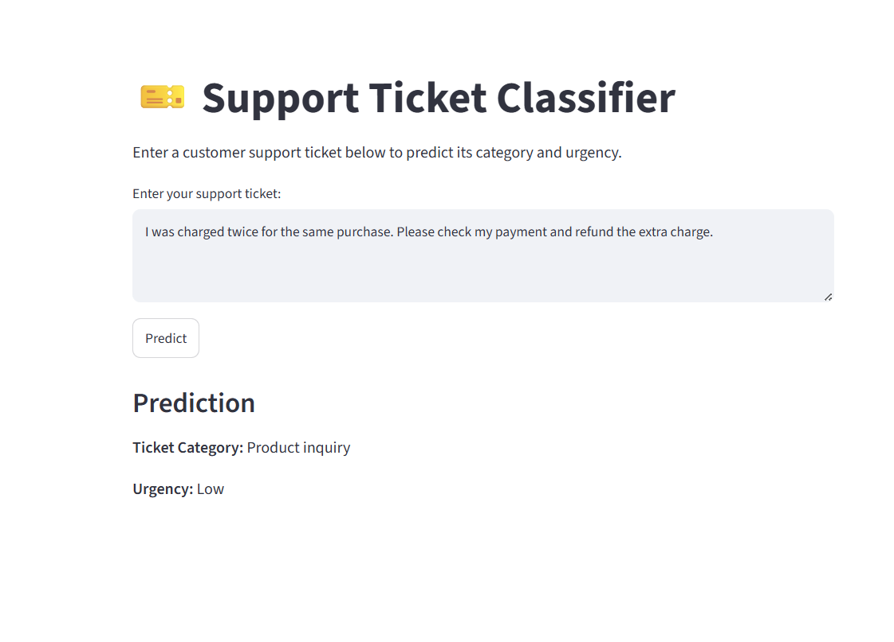

# Support Ticket Category Classifier

## 1. Project Overview

Customer support teams receive a large number of support tickets that need to be manually reviewed and categorized. This project implements a simple NLP-based system that automatically predicts the category of a customer support ticket and assigns an urgency level.

The project was built using Python, pandas, scikit-learn and Streamlit. The classifier uses TF-IDF features with Logistic Regression, while urgency is determined using simple keyword-based rules.

## 2. Dataset

The project uses the Customer Support Ticket Dataset from Kaggle.

The dataset contains 8,469 customer support tickets with 17 columns. For text classification, the `Ticket Subject` and `Ticket Description` fields were combined into a single text input.

The target variable is `Ticket Type`, which contains five categories:

- Billing inquiry
- Cancellation request
- Product inquiry
- Refund request
- Technical issue

The dataset was divided into 80% training data and 20% testing data using a stratified split.

Training samples: 6,775

Testing samples: 1,694

## 3. Approach

### Text Preparation

The ticket subject and ticket description were combined into one text field.

Missing text values were handled using empty strings.

### TF-IDF

TF-IDF (Term Frequency-Inverse Document Frequency) was used to convert the ticket text into numerical features.

The vectorizer was configured to use:

- English stop-word removal
- Up to 10,000 features
- Minimum document frequency of 2
- Unigrams and bigrams

The resulting training data contained 8,179 TF-IDF features.

### Classification

A Logistic Regression classifier was trained on the TF-IDF features.

Logistic Regression was selected because it is a simple and effective baseline for text classification and is one of the recommended approaches for this project.

### Urgency Detection

Urgency was implemented separately using keyword matching.

The system assigns one of three levels:

- High
- Medium
- Low

Examples of high-urgency keywords include:

- urgent
- immediately
- emergency
- critical
- not working
- stopped working

Medium urgency includes terms such as:

- problem
- issue
- error
- unable
- failed
- failure
- not responding

If no urgency keywords are found, the ticket is assigned Low urgency.

## 4. Model Evaluation

The classifier was evaluated on the held-out test set using Accuracy and weighted F1-score.

Results:

| Metric            | Result |
| ----------------- | -----: |
| Accuracy          | 20.54% |
| Weighted F1-score | 20.54% |

The model therefore provides a baseline implementation, but its predictive performance is low.

During dataset inspection, the ticket subjects and descriptions were found to contain substantial noise and inconsistent information. For example, similar ticket subjects appeared across multiple target categories, and some descriptions contained unrelated or inconsistent text.

Because of this, the available text does not provide strong enough information for the model to reliably distinguish the five ticket categories.

The evaluation results are therefore reported as obtained from the provided dataset rather than artificially optimizing the model for a higher score.

## 5. Streamlit Demo

A Streamlit application was created to demonstrate the system.

The user enters a new customer support ticket into the application. The application then:

1. Converts the ticket text into TF-IDF features.
2. Uses the trained Logistic Regression model to predict the ticket category.
3. Applies keyword-based rules to determine urgency.
4. Displays the predicted category and urgency.

Example input:

> I cannot access my account. It is not working and I need help immediately.

Example output:

- Ticket Category: Technical issue
- Urgency: High

## 6. Project Limitations

The main limitation is the quality and consistency of the provided dataset. The text and target labels are not strongly aligned, which results in low classification performance.

The current project is intended as a simple baseline implementation using TF-IDF and Logistic Regression rather than a production-ready support-ticket system.

Better-labelled data, improved text cleaning, and more advanced NLP models could potentially improve classification performance.

## 7. Conclusion

This project demonstrates an end-to-end NLP classification workflow, including dataset preparation, train/test splitting, TF-IDF feature extraction, Logistic Regression training, model evaluation, rule-based urgency detection, model saving, and deployment through a Streamlit application.

The final system successfully provides category and urgency predictions for new support tickets through a simple web interface.

### Demo Screenshot

The screenshot below shows the Streamlit application predicting the category and urgency of a new support ticket.

